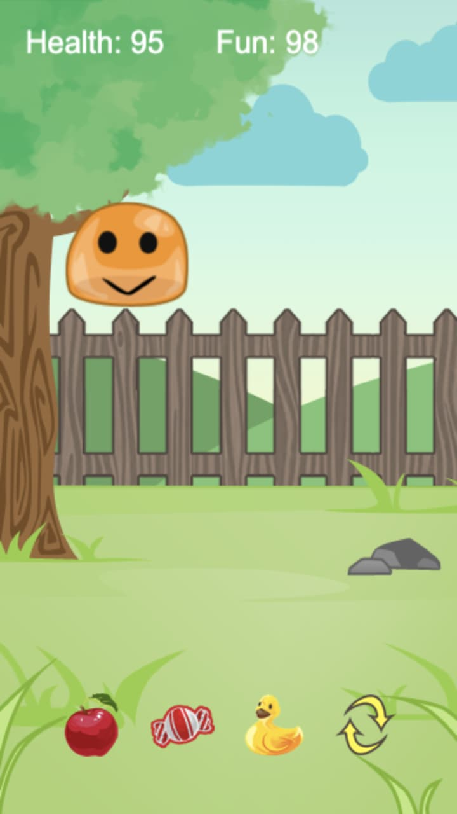
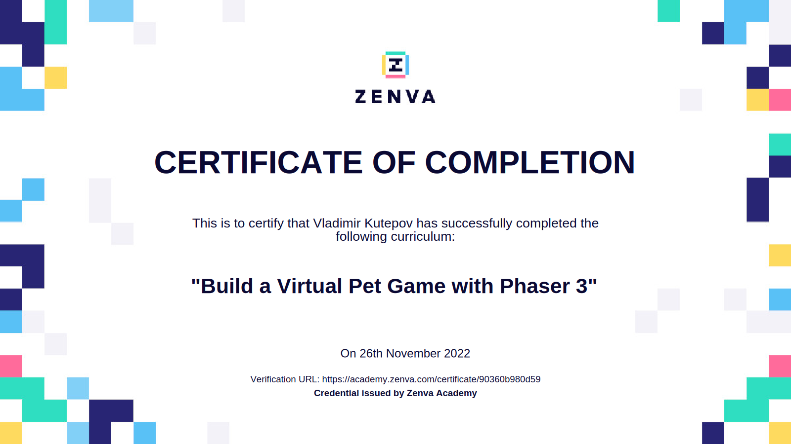

# Virtual Pet Game

Zenva Course URL: https://academy.zenva.com/course/build-a-virtual-pet-game-with-phaser-3/

HTML5 game framework Phaser: https://phaser.io/

[Click here](https://frenzzy.github.io/edu-game-phaser3-virtual-pet/public/) to play Virtual Pet game:

[Click here](https://academy.zenva.com/certificate/90360b980d59) to see the certificate of completion:

